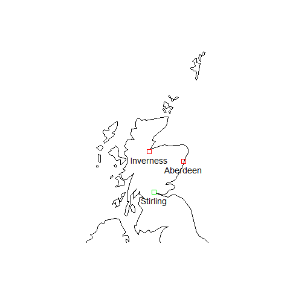

sgo - Simple Geographical Operations (with OSGB36)
================

<!-- README.md is generated from README.Rmd. Please edit that file -->

<!-- badges: start -->

[](https://github.com/clozanoruiz/sgo/actions?workflow=R-CMD-check)
[](https://app.codecov.io/gh/clozanoruiz/sgo?branch=main)
[](https://github.com/clozanoruiz/sgo/releases)
[](https://opensource.org/licenses/BSD-2-Clause)
<!-- badges: end -->

The goal of `sgo` is to provide a set of methods to transform ETRS89
coordinates to the equivalent OSGB36 National Grid coordinates, and
vice-versa, using the [Ordnance Survey’s National Grid Transformation
Model
OSTN15](https://www.ordnancesurvey.co.uk/blog/2016/09/ostn15-new-geoid-britain/).
Additionally, it also has the ability to calculate distances and areas
from groups of points defined in any of the coordinate systems
supported.

The Coordinate Systems supported by `sgo` are:

  - ETRS89: EPSGs 4258, 4937, 4936 and 3035
  - WGS84: EPSGs 4326, 4979, 4978 and 3857
  - OSGB36: EPSGs 27700, 7405 and 4277

Please note that this package assumes that the Coordinate Reference
Systems (CRS) ETRS89 and WGS84 are the same within the UK, but this
shouldn’t be a problem for most civilian use of GPS satellites. If a
high-precision transformation between WGS84 and ETRS89 is required then
it is recommended to use a different package to do the conversion.

According to the Transformations and OSGM15 User Guide, p. 8: *“…ETRS89
is a precise version of the better known WGS84 system optimised for use
in Europe; however, for most purposes it can be considered equivalent to
WGS84.”* and *“For all navigation, mapping, GIS, and engineering
applications within the tectonically stable parts of Europe (including
UK and Ireland), the term ETRS89 should be taken as synonymous with
WGS84.”*.

## Installation

You can install the released version of `sgo` from
[CRAN](https://CRAN.R-project.org) with:

``` r
install.packages("sgo")
```

And the development version from [GitHub](https://github.com/) with:

``` r
# install.packages("remotes")
remotes::install_github("clozanoruiz/sgo")
```

## Usage

``` r
library(sgo)

## sgo_points creation (from lists, matrices or dataframes)
sr <- sgo_points(list(-3.9369, 56.1165), epsg=4326)
sr
#> An sgo object with 1 feature (point) 
#> dimension: XY 
#> EPSG:      4326  
#>         x       y
#> 1 -3.9369 56.1165
ln <- c(-4.22472, -2.09908)
lt <- c(57.47777, 57.14965)
n <- c("Inverness", "Aberdeen")
df <- data.frame(n, ln, lt, stringsAsFactors = FALSE)
locs <- sgo_points(df, coords=c("ln", "lt"), epsg=4326)

library(maps)
map('world', regions=('uk'), xlim=c(-9, 0), ylim=c(54.5, 60.9))
points(x=sr$x, y=sr$y, pch=0, col="green")
points(locs, pch=0, col="red")
text(locs, labels=locs$n, pos=1, cex=0.9)
text(sr, labels="Stirling", pos=1, cex=0.9)
```



``` r

## Convert coordinates to National Grid Reference
bv <- sgo_points(list(x=247455, y=706338, name="Ben Venue"),
coords=c("x", "y"), epsg=27700)
sgo_bng_ngr(bv)$ngr
#> [1] "NN 47455 06338"
# notice the truncating, not rounding:
sgo_bng_ngr(bv, digits=8)$ngr
#> [1] "NN 4745 0633"

## Convert from lon/lat to BNG
lon <- c(-4.25181,-3.18827)
lat <- c(55.86424, 55.95325)
pts <- sgo_points(list(longitude=lon, latitude=lat), epsg=4326)
sgo_lonlat_bng(pts)
#> An sgo object with 2 features (points) 
#> dimension: XY 
#> EPSG:      27700  
#>          x        y
#> 1 259174.4 665744.8
#> 2 325899.1 673996.1

## sgo_transform is a wrapper for all the conversions available
# to BNG:
sgo_transform(locs, to=27700)
#> An sgo object with 2 features (points) and 1 field 
#> dimension: XY 
#> EPSG:      27700  
#>          x        y         n
#> 1 266698.8 845243.9 Inverness
#> 2 394104.5 806535.9  Aberdeen
# to OSGB36 (historical):
sgo_transform(locs, to=4277)
#> An sgo object with 2 features (points) and 1 field 
#> dimension: XY 
#> EPSG:      4277  
#>           x        y         n
#> 1 -4.223366 57.47804 Inverness
#> 2 -2.097450 57.14985  Aberdeen
# to Pseudo-Mercator:
sgo_transform(locs, to=3857)
#> An sgo object with 2 features (points) and 1 field 
#> dimension: XY 
#> EPSG:      3857  
#>           x       y         n
#> 1 -470293.7 7858404 Inverness
#> 2 -233668.5 7790768  Aberdeen

## Calculate distances
# Distance in metres from one point to 2 other points
p1 <- sgo_points(list(-3.9369, 56.1165), epsg=4326)
lon <- c(-4.25181,-3.18827)
lat <- c(55.86424, 55.95325)
pts <- sgo_points(list(longitude=lon, latitude=lat), epsg=4326)
p1.to.pts <- sgo_distance(p1, pts, by.element = TRUE)
p1.to.pts
#> [1] 34279.98 50081.63

# Perimeter in metres of a polygon defined as a series of ordered points:
lon <- c(-6.43698696, -6.43166843, -6.42706831, -6.42102546,
-6.42248238, -6.42639092, -6.42998435, -6.43321409)
lat <- c(58.21740316, 58.21930597, 58.22014035, 58.22034112,
58.21849188, 58.21853606, 58.21824033, 58.21748949)
pol <- sgo_points(list(lon, lat), epsg=4326)
# Create a copy of the polygon with its coordinates shifted one position
# so that we can calculate easily the distance between vertices
coords <- sgo_coordinates(pol)
pol.shift.one <- sgo_points(rbind(coords[-1, ], coords[1, ]), epsg=pol$epsg)
perimeter <- sum(sgo_distance(pol, pol.shift.one, by.element=TRUE))
perimeter
#> [1] 2115.33

## Area of an ordered set of points
A <- sgo_area(pol)
sprintf("%1.2f", A)
#> [1] "133610.63"
# Interpolate new vertices if more accuracy is needed
A <- sgo_area(pol, interpolate=10)
sprintf("%1.2f", A)
#> [1] "133610.64"
```
